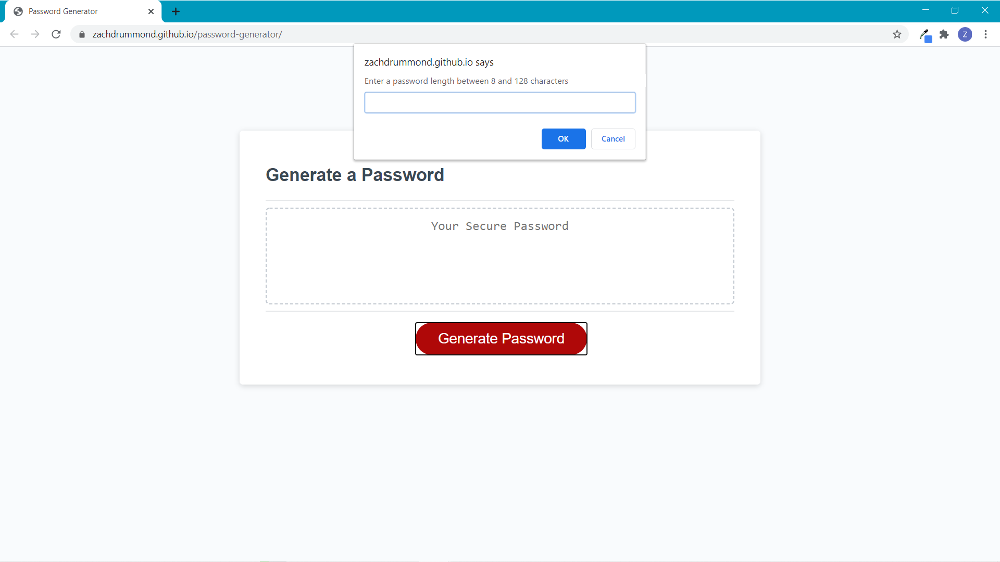
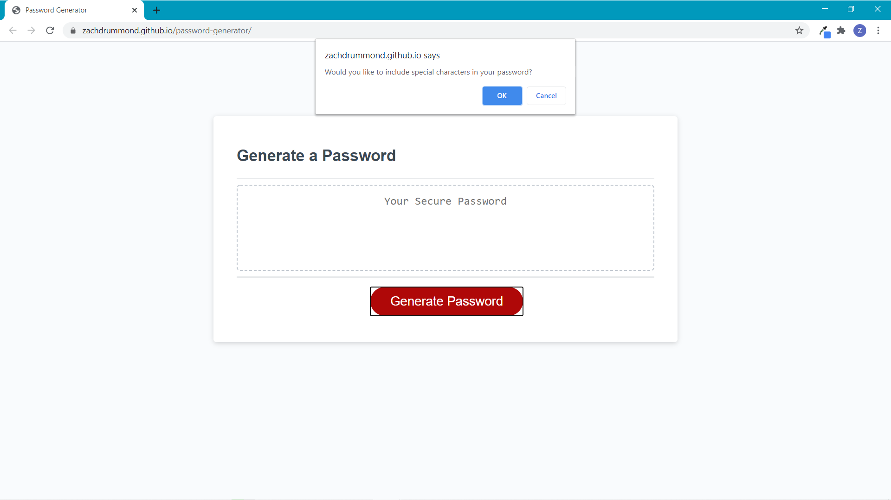
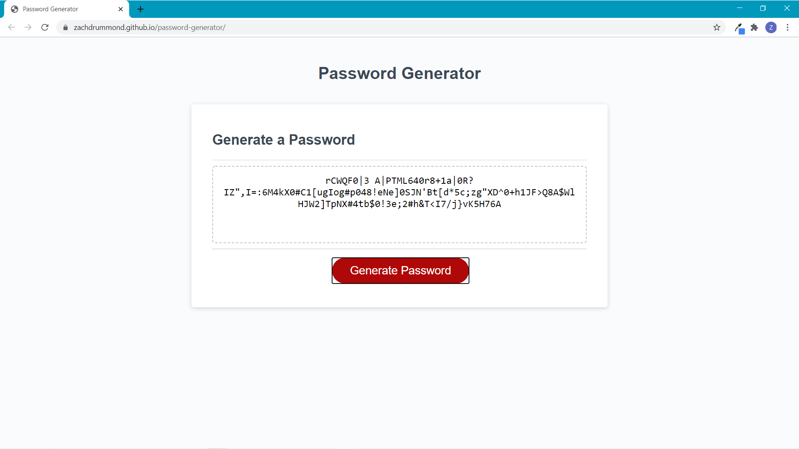

# Password-Generator

## Table of Contents
* [Description](#Description)
* [Design Elements](#Design-Elements)
* [App Preview](#App-Preview)
* [Links](#Links)
* [Credits](#Credits)

## Description
This is a app that generates a random password between 8 and 128 characters using lowercase and uppercase letters, numbers, and special characters. As technology advances, and hackers become more skilled, there is a greater need for more secure passwords. This app allows the user to customize their own password based on length and character preference.

This app was designed using mainly JavaScript.

## Design Elements
### *JavaScript*
* Clean User Interface
* Tested for Errors
* Mobile Responsive
* Dynamically Updated HTML and CSS
* Logical Code Structure
* Sequential Order
* Document Object Model Manipulation
* Objects
* Arrays
* Methods
* Global and Local Variables
* Functions
* Event Listeners
* if...else Statements
* for Loops
* Prompt, Confirm, and Alert Messages
* Comments

## App Preview
### *Main Page*

### *Generate Password*

### *Options*

### *Result*

## Links
* Website: https://zachdrummond.github.io/password-generator/
* GitHub Repository: https://github.com/zachdrummond/password-generator

## Credits
* Object Help: [Mozilla MDN Web Docs](https://developer.mozilla.org/en-US/docs/Web/JavaScript/Reference/Global_Objects/Object)
* Choosing a random property in an object: [Stack Overflow](https://stackoverflow.com/questions/2532218/pick-random-property-from-a-javascript-object)
* Special Character List: [OWASP](https://www.owasp.org/index.php/Password_special_characters)
